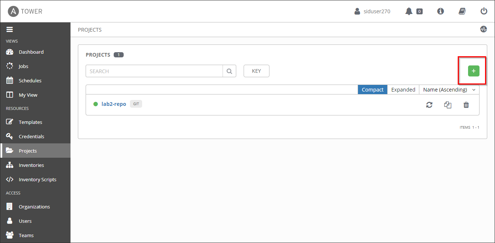
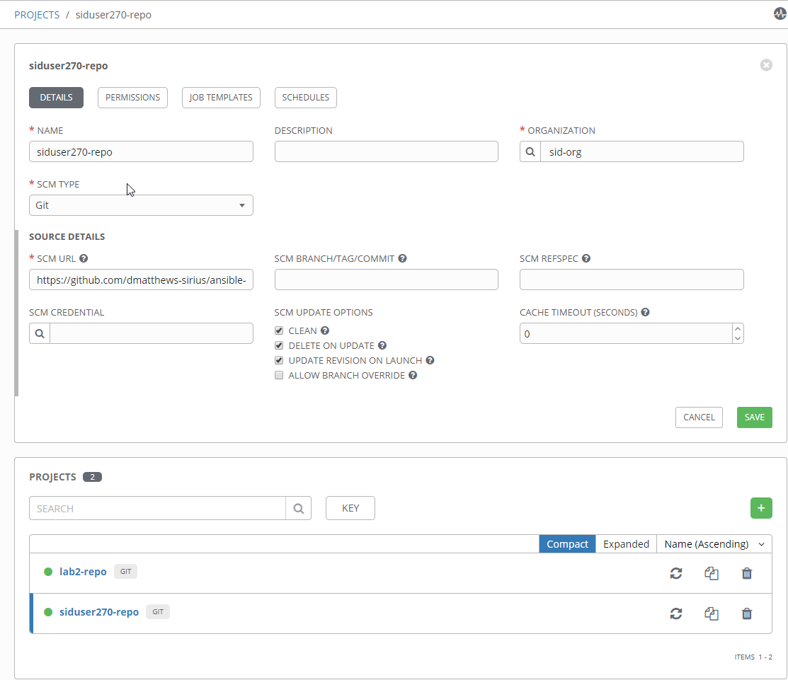
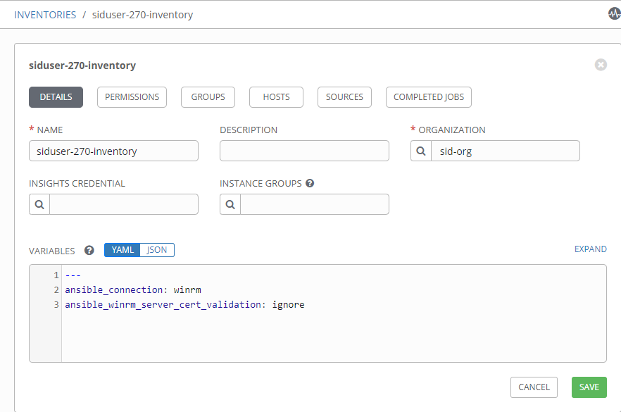
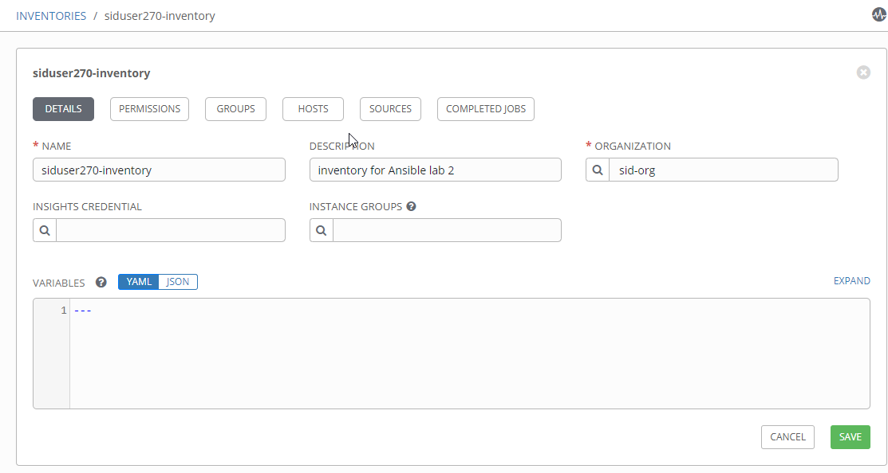
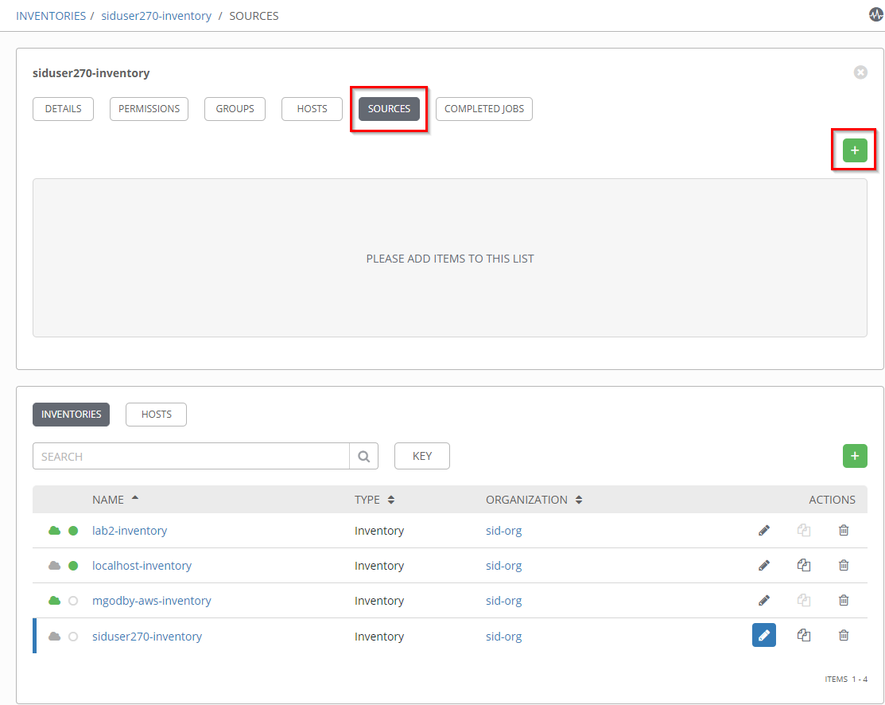
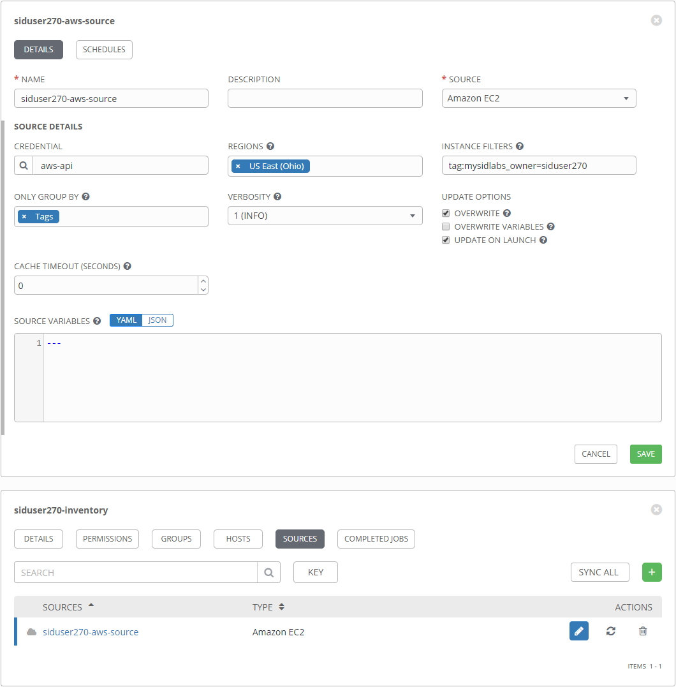
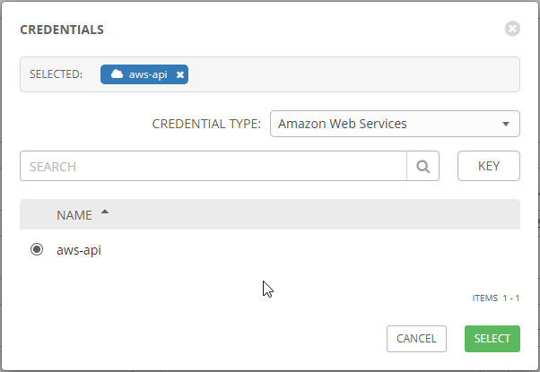
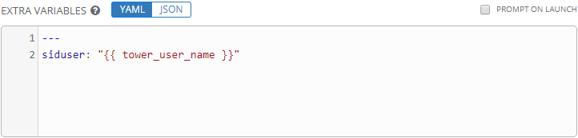

include::global.adoc[]

=== Ansible Lab 1 - Introduction to Ansible Tower
==== Overview
In Lab 2 will introduce _Ansible Tower_ and walk through the configuration of a simple project.  This project will deploy and configure a simple web-application behind a load balancer. 

. Take a quick tour of _Ansible Tower_.
. Provision an AWS ec2 instance.
. Minimaly configure the instance once it has been provisioned.
. Log into the instance once configuration is complete to take a look around.
. Clean up, deprovisioning the instance once the lab is complete.

==== Prerequisites
. You will need a https://https://github.com/[GitHub] account in order to complete this lab.
. Once you are logged into your account, fork the following repository to your personal account:
* https://github.com/mysidlabs/ansible-labs
+
image::images/lab2_000001_github_fork.png[50%]
. Begin the lab.

==== Lab 2 - Ansible Tower
. Log into https://tower.mysidlabs.com[tower]  (tower.mysidlabs.com)
. Take a quick tour of _Tower_ and the features that will be used for this lab.
* *Dashboard* - this is the landing page and provides a bird's eye view of the number of hosts, inventories, and projects being managed as well as a graphic history of recently executed jobs and templates.
+
image::images/lab2_000002_tower_dashboard.png[]
* *Projects* - 

. *Create a Project*
+
Begin by creating a new project by clicking the icon:new[] icon.
+

+
Populate the _New Project_ form with the following information:
+
.. *Name* - `siduser\#\##-repo` where \### is replaced with your user number.
.. *Organization* - `sid-org`
+
[WARNING]
====
Make sure  *`sid-org`* is the organization used for all of the excercises in these labs.
====
+
.. *SCM Type* - `git` - this project will be using the lab repository that was forked as a pre-req to this lab.
.. *SCM URL* - use the https version of the git url. *e.g.* `https:\\github.com\demo-user\ansible-labs.git`.
.. *SCM Update Options* - Select the following options:
** Clean
** Delete on Update
** Update Revision on Launch
.. Click the icon:save[] button - your newly created project will be added to the project list at the bottom of the page.
+

. *Create an Inventory*
+ 
In this step, we will configure a dynamic inventory  by leveraging the Amazon Web Services api together with the judicious use of ec2 host tags.
+
.. Begin by navigating to the _Inventories_ page and create a new inventory by clicking the icon:new[] icon.
+

+
.. Populate the _New Inventory_ form with the following details:
+
* *Name* - `siduser\#\##-inventory` where \### is replaced with your user number.
* *Organization* - `sid-org`
+
.. Click the icon:save[] button. - your newly created inventory will be added to the inventory list at the bottom of the page.
+

. *Configure an Inventory Source*
+
In this step we will configure a source for the newly defined inventory.
+
.. Click the icon:sources-button[] button/tab and then click the icon:new[] icon to open the source creation form.
+

+
.. Populate the _Inventory Source_ form with the following details:
* *Name* - `siduser\#\##-aws-source` where \### is replaced with your user number.
* *Source* - select `Amazon EC2` from the option list.
This will cascade-populate the Credential box with valid credential options for the selected source.
* *Credential* - click the icon:search[] icon and then select `aws-api` from the resulting pop-up.
* *Regions* - Select `US East (Ohio)`
* *Instance Filters* - _verbatim_ `tag:mysidlabs_owner=sinduser###`
+
[WARNING]
====
Please doublecheck the _Regions_ and _Instance Filters_ values, as both fields are *critical* for the deployment and clean-up of the lab infrastructure.
====
+
* *Only Group By* - select `Tags`
* *Update Options* - Select:
** Overwrite
** Update on Launch
.. Click the icon:save[] button and the source will be added to the sources list at the bottom of the page.
+

. *Create and Configure the Create Job Template*
+
In this portion of the lab, we will be creating _Job Templates_ to represent the Ansible plays in the lab repository. We'll begin with creating a _Job Template_ for the _create.yaml_ play in the lab2 folder.
+
.. Click the icon:new[] icon and select _Job Template_ as the template type from the initial pop-up.
.. Populate the _New Job Template_ fields with the following values:
* *Name*: use `siduser\#\##-create`,  where \### is replaced with your user number.
* *Job Type*: `Run`
* *Inventory*: `localhost-inventory`.
+
[NOTE]
====
In Ansible, when connecting to an external API, especially in the creation of infrastructure, the play is run and executed on the localhost.  `localhost-inventory` represents the _Tower_ localhost when running plays such as this.
====
* *Project*: `siduser\#\##-repo` where \### is replaced with your user number.
* *PlaybooK*: `lab2/create.yaml`
* *Credentials*: Click icon:search[] in the _Credentials_ field and then choose `Amazon Web Services` for the _Credential Type_ and then select `aws-api` and then click icon:select-button[]
+

+
* *Instance Groups*: select `Tower`
* *Extra Variables*: In the extra variable field, please add the following, verbatim:
+
`siduser: "{{ tower_user_name}}"`
+

+
[WARNING]
====
Please double check that the extra-variables syntax is correct before saving the template.
====
.. Click the icon:save[] button to save the template.
+
.. icon:todo[] - Run the job template and review the log output.
.. icon:todo[] - Review the dynamic inventory once the job has completed.

. *Create and Configure the Configure Job Template*
+
We'll now create the _Job Template_ for the _configure.yaml_ play from lab2.  This process is very similar to the previous step with the exception that this time we will specify our user _dynamic_ inventory.
+
.. Click the icon:new[] icon and select _Job Template_ from the pop-up.
.. Populate the _New Job Template_ fields with the following values:
* *Name*: use `siduser\#\##-configure`,  where \### is replaced with your user number.
* *Job Type*: `Run`
* *Inventory*: `siduser\#\##-inventory`  where \### is replaced with your user number.
* *Project*: `siduser\#\##-repo` where \### is replaced with your user number.
* *PlaybooK*: `lab2/create.yaml`
* *Credentials*: Click icon:search[] in the _Credentials_ field and then choose `Machine` for the _Credential Type_ and then select `ansible-labs-only` and then click icon:select-button[]
+

+
* *Instance Groups*: select `Tower`
* *Extra Variables*: In the extra variable field, please add the following, verbatim:
+
`siduser: "{{ tower_user_name}}"`
+

+
[WARNING]
====
Please double check that the extra-variables syntax is correct before saving the template.
====
.. Click the icon:save[] button to save the template.
.. icon:todo[] Execute the job template and review the log output.
.. icon:todo[] grab lb ip from output and visit the web-app in a browser.